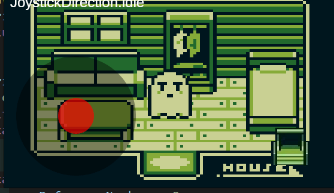
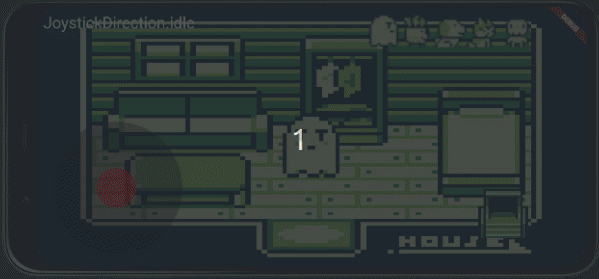

# flame animation demo

Flutter flame animation demo

## switch scene when character enters door

## switch character

## learning objectives

### graphics

* `Sprite`
* `SpriteAnimation` from sprite sheet
* `SpriteAnimationGroupComponent`

### movement

* collision
* `JoystickComponent`

### screen

* resize
* web, android, linux desktop
* GitHub actions to deploy to web
  * workflow permissions must be set to read and write
